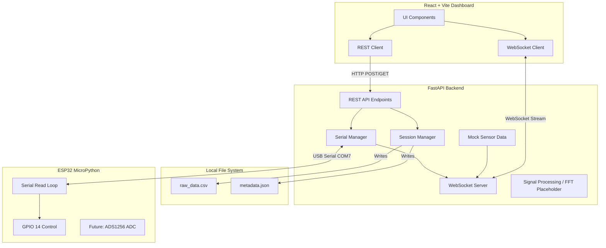

# Architecture Overview

## Data Flow
1. **Hardware Control**: The user clicks a button on the React frontend. A REST POST request is sent to the FastAPI backend. The backend `SerialManager` sends the command string ("ON" or "OFF") over the serial port to the ESP32. The ESP32 parses the string and toggles GPIO 14.
2. **Real-time Streaming**: The React frontend establishes a WebSocket connection to the FastAPI backend. Currently, the backend streams mock data generated at a fixed interval. In the future, this data will come directly from the `SerialManager` reading from the ESP32.
3. **Session Recording**: When a session is started via the frontend, the backend creates a new folder in `recordings/`. It begins appending incoming data points to a `raw_data.csv` file and saves session metadata to a `metadata.json` file.
